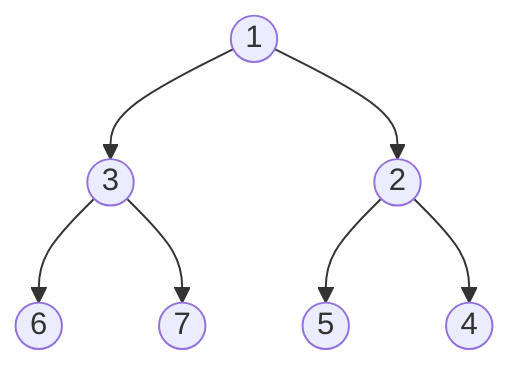

## Binary Tree

### Tree height problem

**Statement**: Given a binary tree, find its height.

**Approach**: Transverse the tree, keeping track of the height of the left and right subtrees. Return the maximum height.
1. Base case: empty (or null) tree has height -1.
2. Recursive case: return 1 + the maximum height of the left and right subtrees.


```python
def height(node):

    # empty tree
    if node is None:
        return -1
    
    # recursive case
    return 1 + max(height(node.left), height(node.right))
```

**Complexity**:
- Time: O($n$), need to transverse every node on the tree.
- Space: O($n$), we have n calls to ```height()```.


### 199. Binary Tree Right Side View

**Statement**: Given a binary tree, imagine yourself standing on the right side of it, return the values of the nodes you can see ordered from top to bottom.

**Approach**: Transverse the tree, keeping track of the rightmost node at each level. Return the list of rightmost nodes.

We will iterate thorugh the tree and each node needs to know:
1. What level am I at?
2. Is there any node at my level that is more to the right than me?
    a. If no, add to right_side.

A way to answer 2. is to make sure that at each level; rightmost nodes are visited first.
This hints us to a do a **Breadth First Search** since we need to exhaust each level before moving to the next.

To visit rightmost nodes first, we just add them to the queue first.

The following tree shows the order that nodes will be visited using the previously mentioned logic.

<div align="center">



</div>

Now, to keep track of the level we define the root as being at level 0 and any child nodes will always be at level=current_level+1.

**Complexity**:
- Time: $O(n)$: we visit each node in the tree at least once.
- Space: $O(1)$: no new data structures are created; we just go through the tree.


