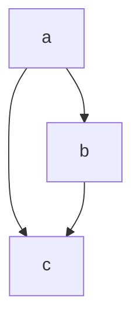

## Graph

### Depth-first search

**Recursive**
```python
for node in graph:
    dfs(node, graph)

def dfs(node, graph):
    for neighbor in graph[node]:
        dfs(neighbor, graph)
```

### Minimum island problem

**Statement**: Given a 2D grid of Land and Water, find the smallest island in the grid. An island is defined as land connected horizontally or vertically.

```python
grid = [
    ["W", "L", "W", "W", "W"],
    ["W", "L", "W", "W", "W"],
    ["W", "W", "W", "L", "W"],
    ["W", "W", "L", "L", "W"],
    ["L", "W", "W", "L", "L"],
    ["L", "L", "W", "W", "W"],
]
minimum_island(grid) # 2
```
**Approach**:
1. Iterate through the grid with nested ```for``` loops.
2. On any land cell, perform a **depth-first search** to find the size of the island.
3. Keep track of the visited cells to avoid infinite loops.

### Closest carrot problem

**Statement**: Given a 2D grid of Open Spaces "O"s, Walls "X"s, and Carrots "C"s, find the closest carrot from a given initial position.

```python
grid = [
  ['O', 'O', 'O', 'O', 'O'],
  ['O', 'X', 'O', 'O', 'O'],
  ['O', 'X', 'X', 'O', 'O'],
  ['O', 'X', 'C', 'O', 'O'],
  ['O', 'X', 'X', 'O', 'O'],
  ['C', 'O', 'O', 'O', 'O'],
]

closest_carrot(grid, 1, 2) # -> 4
```
**Approach**:
1. Use a **breadth-first search** to find the shortest path from the initial position to the closest carrot. **BFS** will explore all directions equally, so it will find the shortest path.
2. Keep track of the visited cells to avoid infinite loops.
3. Keep track of the distance to the origin by adding 1 to a ```distance``` variable.
4. Return the ```distance``` when the carrot is found.

### Longest path problem

**Statement**: Givenn an adjacency list for a **directed acyclic graph** (DAG), find the longest path (number of edges) in the graph.


<table>
<tr>
<td>

```python
graph = {
'a': ['c', 'b'],
'b': ['c'],
'c': []
}
longest_path(graph) # -> 2
```

</td>
<td style="text-align: center;">




</td>
</tr>
</table>


**Approach**: 
1. Find the terminal nodes of the graph. A terminal node is a node with no outgoing edges.
    - Each terminal node has the potential to be the start of the longest path.
    - We need to assign a distance to each node, in particular a terminal node has a distance of 0 (we are going to count backwards).
2. For each node in the graph, do a **depth-first search**.
3. The base case is an already visited node, in which case we return the distance.
4. The recursive case is to return the maximum distance of the neighbors plus 1.
5. Finally, return the maximum distance found.

**Complexity**:
- Time: O(E) where E is the number of edges in the graph.
- Space: O(N) where N is the number of nodes in the graph.

